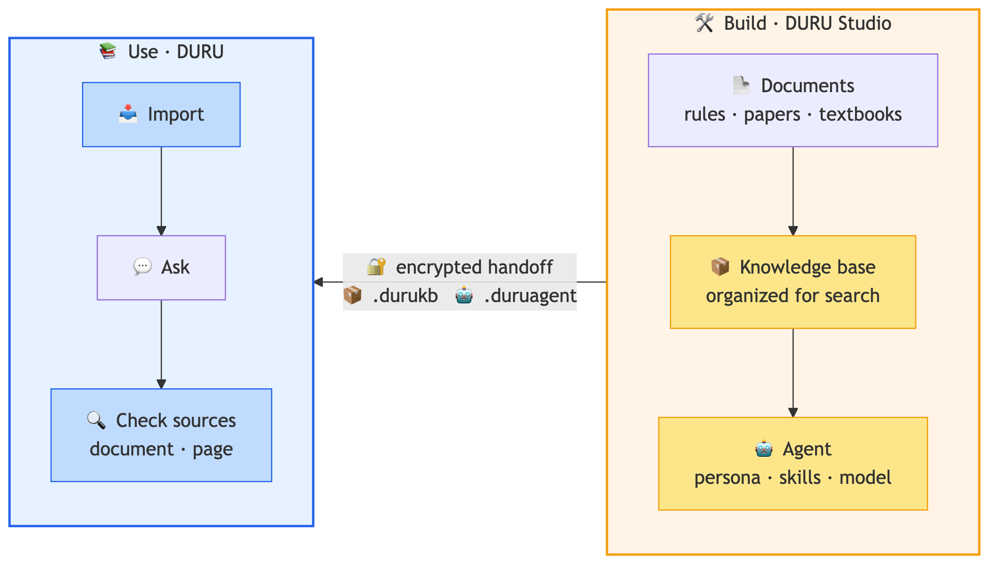
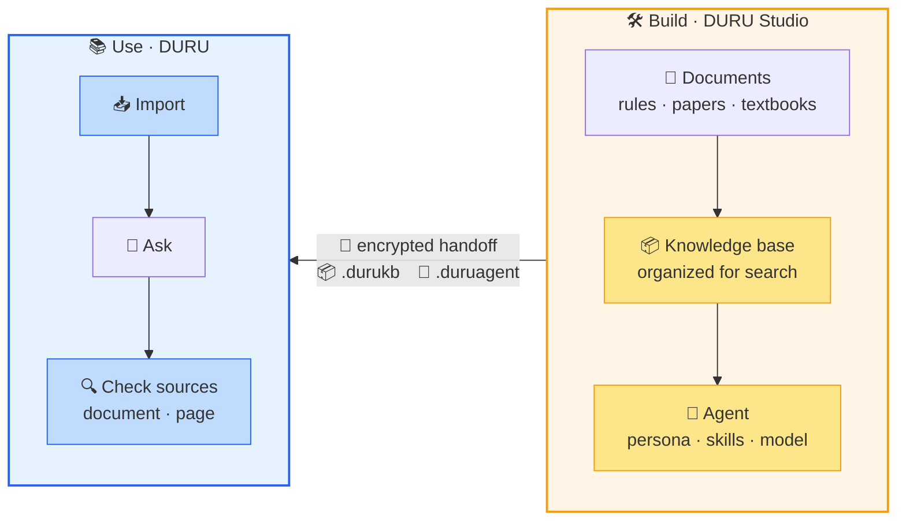

# 📚 DURU — AI That Helps All Around

[한국어](README.md) | **English**

> An AI agent on your own PC, helping across research, education, and everyday work

---

  

---

## 🔎 At a glance

DURU is **an AI that answers from documents you own**.
It is not a cloud service — you install it on your own PC.

- 📄 **Answers come from your documents** — put in rules, papers, or textbooks, and DURU finds the passage and tells you **which document, which page**.
- 🔒 **Nothing leaves your machine** — both the documents and the AI model stay on your PC. It runs on **air-gapped internal networks**.
- 📦 **Build once, share with everyone** — a knowledge base or an agent someone prepared arrives **as a file**, ready to use.
- 💻 **Installation is all it takes** — no server, no dedicated graphics card, no one to operate it.

---

## 🔗 DURU and DURU Studio

DURU is the **using** side. The heavy preparation happens once on the **building** side,
and the result is handed over as a file.

  

Diagram source (mermaid) — edit this and regenerate the image

Regenerate: `npx -y @mermaid-js/mermaid-cli@11 -i diagram.mmd -o assets/duru_flow_en.png -b white -s 3`

| | What it does |
| --- | --- |
| 📚 **DURU** one per person | Imports the files it receives, then **asks questions and checks the sources** |
| 🛠️ **DURU Studio** one per organization | Turns documents into a knowledge base, builds agents, and **exports them as files** |

> [!NOTE]
> You don't have to build anything yourself. **When a knowledge base and an agent arrive as files,**
> they work immediately — no preparation needed.

---

## 👥 Where it fits

| Field | The situation | What DURU does |
| --- | --- | --- |
| 🏛️ Administration | Rules and guidelines are vast, and it's unclear where to look | Ask "is this allowed under our rules?" and it finds **the relevant clause** and explains it |
| 🔬 Research | You need one passage out of a pile of papers and reports | One question, and it points to **the page that backs the answer** |
| 🎓 Education | Making questions from course material, or studying alone | Builds quizzes from textbooks and re-explains in simpler terms |
| 💼 Office work | Summaries and first drafts keep coming back | Works alongside the document you have open |

---

## ✨ What it does

### 🔍 Answers that point to their source

A general chatbot can state something false convincingly.
Where rules are involved, that is not help — it is a hazard.

DURU searches **only within the documents you registered**, and shows where each answer came from.
Click a source and it jumps **to that exact spot in the original**. Verifying takes about thirty seconds.
When it cannot find grounds, it says so rather than inventing an answer.

Because it reads **where** each paragraph, table, and figure sits on the page,
it can point to the precise location behind an answer.

Wording does not have to match. Ask about "research misconduct" and it will surface clauses
that never use that phrase. Conversely, something like "Article 7-2" — where **the exact form matters** —
is not missed either.

### 📚 Knowledge bases

Feed it rules, papers, or textbooks, and it organizes them into something searchable.
**Point it at a folder** and everything underneath is registered automatically;
PDF, HWP, Word, Excel, PowerPoint, e-books, and scanned images are all handled.

You can keep several separate. Rules in one, papers in another, textbooks in a third —
ask only the one you need.

**Starter knowledge bases** are in preparation for law, science and technology, economics,
public administration, and education.

Coming soon — items cleared for copyright (the knowledge base files are not distributed yet)

Fourteen full statutes from the Korean National Law Information Center. Korean statutes are
non-protected works under Article 7(1) of the Copyright Act, so they may be redistributed without conditions.

Constitution · Civil Act · Criminal Act · Commercial Act · Criminal Procedure Act · Labor Standards Act ·
Personal Information Protection Act · Copyright Act, and six more

Science and technology, economics, public administration, and education will be added once their
redistribution terms are confirmed.

### 🤖 Five agents, each with a different field

Each agent keeps **its own conversation and memory**.
Administrative work continues with Haru, study with Toto, separately.

| Agent | Role | Good at |
| --- | --- | --- |
| ✨ **Byeoli** | General assistant | Summarizing, translating, analyzing, answering across documents |
| 🐨 **Haru** | Administration | Drafting official letters, finding grounds in rules and guidelines |
| 🦊 **Miro** | Work partner | Pulling out key points and action items, reviewing documents |
| 🐥 **Toto** | Study buddy | Quizzes, plain-language explanations, checking what you know |
| 🦉 **Choco** | Teaching assistant | Writing questions, preparing class material |

### 📦 Handed over as a single file

A knowledge base is saved as `.durukb`, an agent as `.duruagent`.
The person receiving it **only has to import** — everything works as it did.

This matters because the preparation is heavy.
Turning hundreds of documents into a knowledge base takes time even on a capable PC,
and there is no reason for a hundred people to repeat it.
**One person builds it and passes it on;** everyone else searches immediately.
In practice, moving a 159-document set required no rebuilding at all.

Handovers are protected.

- **Encryption** — a file with a password opens only for those who know it. Its contents stay unreadable in transit by email or USB.
- **Permissions** — read-only means the recipient can view and search, but not add or change documents.
- **Integrity check** — damage in transit is detected before the file is opened.

### 🔒 Runs on your own machine

DURU is **a program installed on your PC**, not a cloud service.
Documents, knowledge bases, and conversation history all stay there.
Material that **cannot be uploaded anywhere** is exactly where DURU belongs.

The AI model stays local too. Through **Ollama**, DURU runs small models installed on the PC,
and integration is confirmed with Korea's sovereign foundation models —
**Solar** (Upstage) and **EXAONE** (LG AI Research).
No dedicated graphics card is required, and it works on **networks with no internet access**.

> [!TIP]
> **If you need a server that an organization shares, look at [DOREA-X](https://github.com/leeryong/DOREA-X)** —
> the server-side product in the same family. It fits when material can be uploaded and someone can operate it;
> otherwise DURU fits — [how the two compare](docs/DURU.en.md#-6-running-locally--protecting-your-material)

---

## 📖 In more detail

What a knowledge base is, how the five agents are put together,
how sources are presented, and how packages are exchanged

→ **[DURU — detailed introduction](docs/DURU.en.md)**

---

## 📥 Availability

A Windows installer is in preparation. This page will carry the announcement when it is released.

---

## 🌌 Related projects

DURU is built on the document AI work of KISTI's **BLUESKY** project.

| System | About |
| --- | --- |
| 🌌 [KISTI-NTIS BLUESKY](https://github.com/leeryong/KISTI_BLUESKY) | Hub for human–AI collaboration projects |
| 📄 [DOREA-X](https://github.com/leeryong/DOREA-X) | **Server-side** — document AI an organization shares. Understanding, analysis, report writing |
| 🛠️ [NELLA](https://github.com/leeryong/NELLA) | Agentic LLMOps — build a domain LLM from documents |
| 🎩 [Scarlet](https://github.com/leeryong/Scarlet) | Multi-agent knowledge search and reasoning (Holmes–Watson) |
| 🌐 [TAW (The Agents Web)](https://github.com/leeryong/The_Agents_Web_TAW) | A web where agents and people work together |
| 🗂️ [ParserTry](https://github.com/leeryong/ParserTry) | Run and compare 30 PDF parsers in a local web app |

---

  
    <b>DURU</b> · AI that helps all around — KISTI BLUESKY 
    Contact: Ryong Lee (ryonglee@kisti.re.kr)
  

