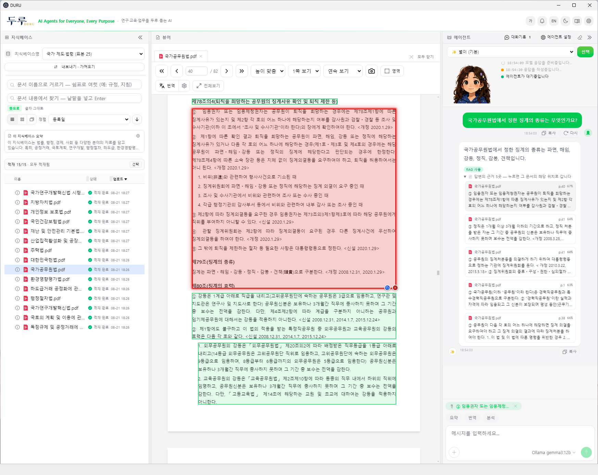
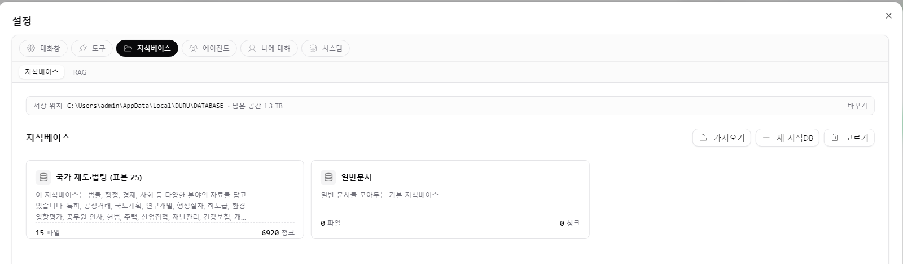
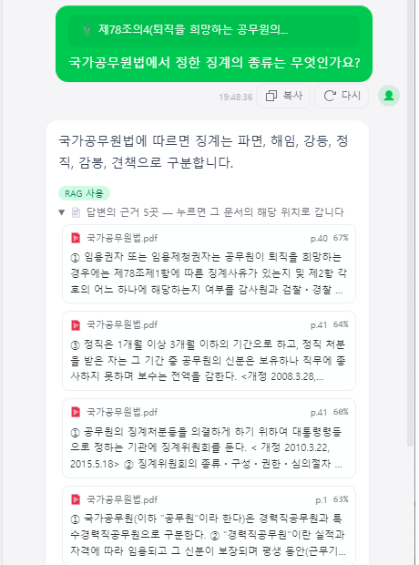
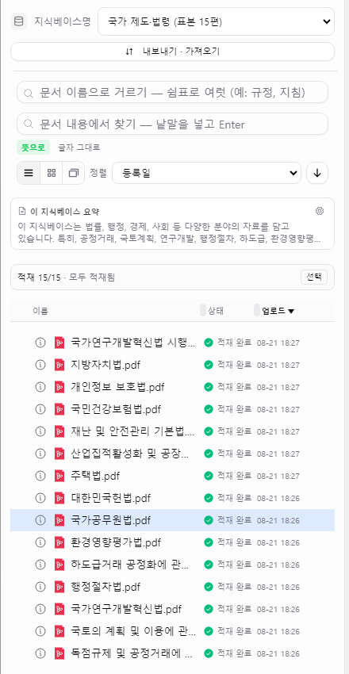
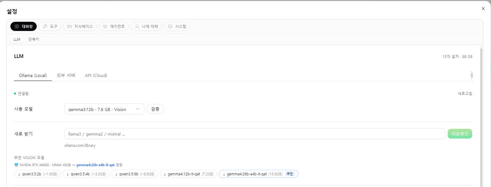
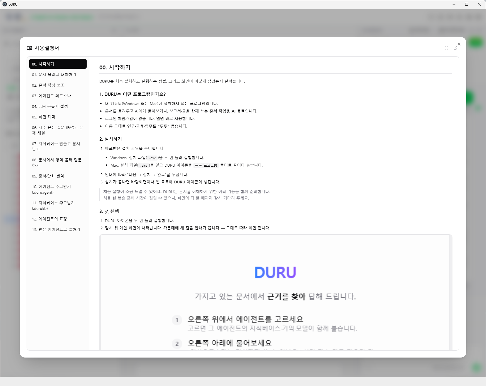

# 📚 DURU — AI That Helps All Around

[한국어](README.md) | **English**

> An AI agent on your own PC, helping across research, education, and everyday work

---

  

---

> ## 📢 The Windows build is out — **v0.8.0**
>
> 2026-08-21
>
> One installer (about 300 MB) and you're done. → **[Download](../../releases/latest)**
> **A sample knowledge base ships inside it** — "National Statutes (sample of 15)" is installed
> with DURU, so there is something to ask about from the very first launch.
> ⚠️ **It is a sample, and only that** — 15 statutes, not a complete legal database. It's there so
> you can see how DURU behaves right away. For real work, load the documents you actually need.
>
> 🍎 **A macOS build is coming soon.** We'll announce it here as soon as it's ready.

---

## 🔎 At a glance

DURU is **an AI that answers from documents you own**.
It is not a cloud service — you install it on your own PC.

- 📄 **Answers come from your documents** — put in rules, papers, or textbooks, and DURU finds the passage and tells you **which document, which page**.
- 🔒 **Nothing leaves your machine** — both the documents and the AI model stay on your PC. It runs on **air-gapped internal networks**.
- 📦 **Build once, share with everyone** — a knowledge base or an agent someone prepared arrives **as a file**, ready to use.
- 💻 **Installation is all it takes** — no server, no dedicated graphics card, no one to operate it.

---

## 🖥️ What it looks like

  

**Knowledge base** on the left, **document viewer** in the middle, **agent** on the right.
Click a source under an answer and the viewer jumps to that document and position, with the quoted passage boxed.

---

## 📦 Built once, used by everyone

Preparation is heavy. Organising hundreds of volumes of regulations takes time even on a good machine.
There is no reason for a hundred colleagues to each repeat it.

**One person builds it and hands out the file.** The receiving side just imports —
searchable **immediately**, with nothing recomputed.

  

> [!NOTE]
> You don't have to build one. **If someone hands you a knowledge base file**,
> you can use it on the spot with no preparation at all.

---

## 👥 Where it fits

| Field | The situation | What DURU does |
| --- | --- | --- |
| 🏛️ Administration | Rules and guidelines are vast, and it's unclear where to look | Ask "is this allowed under our rules?" and it finds **the relevant clause** and explains it |
| 🔬 Research | You need one passage out of a pile of papers and reports | One question, and it points to **the page that backs the answer** |
| 🎓 Education | Making questions from course material, or studying alone | Builds quizzes from textbooks and re-explains in simpler terms |
| 💼 Office work | Summaries and first drafts keep coming back | Works alongside the document you have open |

---

## ✨ What it does

### 🔍 Answers that point to their source

A general chatbot can state something false convincingly.
Where rules are involved, that is not help — it is a hazard.

DURU searches **only within the documents you registered**, and shows where each answer came from.
Click a source and it jumps **to that exact spot in the original**. Verifying takes about thirty seconds.
When it cannot find grounds, it says so rather than inventing an answer.

Because it reads **where** each paragraph, table, and figure sits on the page,
it can point to the precise location behind an answer.

  

A real exchange — asked *"What kinds of disciplinary action does the State Public Officials Act provide for?"*,
it answers **removal, discharge, demotion, suspension, salary reduction and reprimand**, and lists five sources
with document and page. The percentage on the right is how close that passage is to the question.

  

Click a source and it goes to that document, that position. Not "it's on page N" but a box **on the article itself**,
so you can confirm at a glance — just under the box sits **Article 79 (Kinds of Disciplinary Action)**.

Wording does not have to match. Ask about "research misconduct" and it will surface clauses
that never use that phrase. Conversely, something like "Article 7-2" — where **the exact form matters** —
is not missed either.

### 📚 Knowledge bases

Feed it rules, papers, or textbooks, and it organizes them into something searchable.
**Point it at a folder** and everything underneath is registered automatically;
PDF, HWP, Word, Excel, PowerPoint, e-books, and scanned images are all handled.

You can keep several separate. Rules in one, papers in another, textbooks in a third —
ask only the one you need.

  

**Starter knowledge bases** are in preparation for law, science and technology, economics,
public administration, and education.

> [!TIP]
> **A sample, "National Statutes (sample of 15)", ships inside the installer.**
> Install DURU and you can start asking on the spot — bearing in mind that it is
> **15 statutes, not the complete body of law**.

**We have more prepared. Get in touch if you need one.**

| Knowledge base | What it is | Availability |
| --- | --- | --- |
| **National Statutes, 598 documents** | The **legal basis behind 578 institutions** that run Korean society — 368 acts, 109 enforcement decrees, 56 enforcement rules, 46 regulations, 19 directives and notices. Act down to enforcement rule, **as one set**. The full version of the 15 above. | Ask us — statutes carry no copyright restriction, but at **3.7 GB** it can't be hosted here |
| **KISTI regulations, 159 documents** | An institution's internal rules and guidelines | Available to **KISTI members** on request |

<b>What's inside</b> — 15 full statutes from the Korean National Law Information Center

 

| | Statute |
| --- | --- |
| Foundational | Constitution of the Republic of Korea |
| Administration | State Public Officials Act · Local Autonomy Act · Administrative Procedures Act |
| Personal life | Personal Information Protection Act · National Health Insurance Act · Housing Act |
| Land, environment, safety | National Land Planning and Utilization Act · Environmental Impact Assessment Act · Framework Act on the Management of Disasters and Safety |
| Fair trade, industry | Monopoly Regulation and Fair Trade Act · Fair Transactions in Subcontracting Act · Industrial Cluster Development and Factory Establishment Act |
| R&D | Act on National R&D Innovation · its Enforcement Decree |

Korean statutes are **non-protected works** under Article 7(1) of the Copyright Act, so they may be
redistributed without conditions.

Science and technology, economics, public administration and education will follow as
redistribution terms are settled.

### 🤖 Five agents, each with a different field

Each agent keeps **its own conversation and memory**.
Administrative work continues with Haru, study with Toto, separately.

| Agent | Role | Good at |
| --- | --- | --- |
| ✨ **Byeoli** | General assistant | Summarizing, translating, analyzing, answering across documents |
| 🐨 **Haru** | Administration | Drafting official letters, finding grounds in rules and guidelines |
| 🦊 **Miro** | Work partner | Pulling out key points and action items, reviewing documents |
| 🐥 **Toto** | Study buddy | Quizzes, plain-language explanations, checking what you know |
| 🦉 **Choco** | Teaching assistant | Writing questions, preparing class material |

### 📦 Handed over as a single file

A knowledge base is saved as `.durukb`, an agent as `.duruagent`.
The person receiving it **only has to import** — everything works as it did.

This matters because the preparation is heavy.
Turning hundreds of documents into a knowledge base takes time even on a capable PC,
and there is no reason for a hundred people to repeat it.
**One person builds it and passes it on;** everyone else searches immediately.
In practice, moving a 159-document set required no rebuilding at all.

Handovers are protected.

- **Encryption** — a file with a password opens only for those who know it. Its contents stay unreadable in transit by email or USB.
- **Permissions** — read-only means the recipient can view and search, but not add or change documents.
- **Integrity check** — damage in transit is detected before the file is opened.

### 🔒 Runs on your own machine

DURU is **a program installed on your PC**, not a cloud service.
Documents, knowledge bases, and conversation history all stay there.
Material that **cannot be uploaded anywhere** is exactly where DURU belongs.

The AI model stays local too. Through **Ollama**, DURU runs small models installed on the PC,
and integration is confirmed with Korea's sovereign foundation models —
**Solar** (Upstage) and **EXAONE** (LG AI Research).
No dedicated graphics card is required, and it works on **networks with no internet access**.

> [!TIP]
> **If you need a server that an organization shares, look at [DOREA-X](https://github.com/leeryong/DOREA-X)** —
> the server-side product in the same family. It fits when material can be uploaded and someone can operate it;
> otherwise DURU fits — [how the two compare](docs/DURU.en.md#-6-running-locally--protecting-your-material)

---

## 📖 In more detail

What a knowledge base is, how the five agents are put together,
how sources are presented, and how packages are exchanged

→ **[DURU — detailed introduction](docs/DURU.en.md)**

---

## 📥 Downloads

| | |
| --- | --- |
| **DURU Setup 0.8.0.exe** | Windows 10/11 (64-bit) · about 300 MB · [Download](../../releases/latest) |

The installer **contains the "National Statutes (sample of 15)" knowledge base.** It is prepared
once on first launch, so there is nothing extra to download or import.
Grab the `.durukb` separately only if you want to hand it to someone or load it again.

> [!WARNING]
> **This is a sample.** Fifteen statutes, not a complete legal database — it's there so you can see
> how DURU works from the first minute. For actual work, build your own knowledge base from the
> documents you need. For authoritative text, consult the
> [Korean Law Information Center](https://www.law.go.kr).

| If you want it separately | |
| --- | --- |
| **National Statutes (sample of 15).durukb** | about 70 MB · [Download](../../releases/latest) |

> [!NOTE]
> 🍎 **A macOS build is coming soon.** Only the Windows build exists today.
> It will appear here and on [Releases](../../releases) as soon as it's ready.
> Using it is the same; only installing differs — open the `.dmg` and drag DURU into
> your `Applications` folder.

**Installing**

1. Run the `.exe`. There's no code signature, so SmartScreen warns the first time → **More info → Run anyway**.
2. On first launch a banner offers the **document parser**. One download (about 1.1 GB).
3. Pick a model to answer with — Settings → Chat → LLM. DURU looks at your graphics card and suggests one.

  

4. **A knowledge base is already there.** To add more, drag a `.durukb` onto the window,
   or Settings → Knowledge Base → **Import**.

**First time?** The middle of the window tells you what to do first.

1. Set up a **knowledge base** on the left (one is already there)
2. Pick an **agent** at the top right
3. **Ask** at the bottom right — plain words are fine
4. Click a **source** under the answer — it unfolds which document and page

The book icon at the top right opens the **user guide** (14 chapters) inside the app.

  

---

## 🌌 Related projects

DURU is built on the document AI work of KISTI-NTIS **BLUESKY** project.

| System | About |
| --- | --- |
| 🌌 [KISTI-NTIS BLUESKY](https://github.com/leeryong/KISTI_BLUESKY) | Hub for human–AI collaboration projects |
| 📄 [DOREA-X](https://github.com/leeryong/DOREA-X) | **Server-side** — document AI an organization shares. Understanding, analysis, report writing |
| 🛠️ [NELLA](https://github.com/leeryong/NELLA) | Agentic LLMOps — build a domain LLM from documents |
| 🎩 [Scarlet](https://github.com/leeryong/Scarlet) | Multi-agent knowledge search and reasoning (Holmes–Watson) |
| 🌐 [TAW (The Agents Web)](https://github.com/leeryong/The_Agents_Web_TAW) | A web where agents and people work together |
| 🗂️ [ParserTry](https://github.com/leeryong/ParserTry) | Run and compare 30 PDF parsers in a local web app |

---

## 📄 Open source we lean on

- **Reading documents** — [OpenDataLoader PDF](https://github.com/opendataloader-project/opendataloader-pdf) · [Docling](https://github.com/docling-project/docling) · [PDFium](https://github.com/pypdfium2-team/pypdfium2) · [pdfplumber](https://github.com/jsvine/pdfplumber) · [MarkItDown](https://github.com/microsoft/markitdown) · [pikepdf](https://github.com/pikepdf/pikepdf)
- **OCR** — [PaddleOCR](https://github.com/PaddlePaddle/PaddleOCR) · [Tesseract](https://github.com/tesseract-ocr/tesseract) · [manga-ocr](https://github.com/kha-white/manga-ocr)
- **Search and memory** — [Qdrant](https://github.com/qdrant/qdrant) · [Mem0](https://github.com/mem0ai/mem0) · [BGE-M3](https://huggingface.co/BAAI/bge-m3)
- **Running models** — [Ollama](https://github.com/ollama/ollama) · [PyTorch](https://github.com/pytorch/pytorch) · [ONNX Runtime](https://github.com/microsoft/onnxruntime)
- **Framework and UI** — [FastAPI](https://github.com/fastapi/fastapi) · [SQLAlchemy](https://github.com/sqlalchemy/sqlalchemy) · [SQLite](https://www.sqlite.org/) · [React](https://github.com/facebook/react) · [Vite](https://github.com/vitejs/vite) · [PDF.js](https://github.com/mozilla/pdf.js) · [Tailwind CSS](https://github.com/tailwindlabs/tailwindcss) · [Radix UI](https://github.com/radix-ui/primitives)
- **Tool calling** — [Model Context Protocol](https://github.com/modelcontextprotocol)

Each item's role, license and URL live in the app — Settings → System → About.
[comic-translate](https://github.com/ogkalu2/comic-translate) (GPL-3.0), used for comic translation, is not bundled; DURU only talks to a separate program you run.

---

## 👨‍💻 Developers

KISTI-NTIS **BLUESKY** — *Harmonizing Human and AI Collaboration* · [github.com/leeryong/KISTI_BLUESKY](https://github.com/leeryong/KISTI_BLUESKY)

* Ryong Lee ([ryonglee@kisti.re.kr](mailto:ryonglee@kisti.re.kr))

---

## 📞 Contact

* Ryong Lee ([ryonglee@kisti.re.kr](mailto:ryonglee@kisti.re.kr))

---

  
    <b>DURU</b> · AI that helps all around — KISTI-NTIS BLUESKY
  

