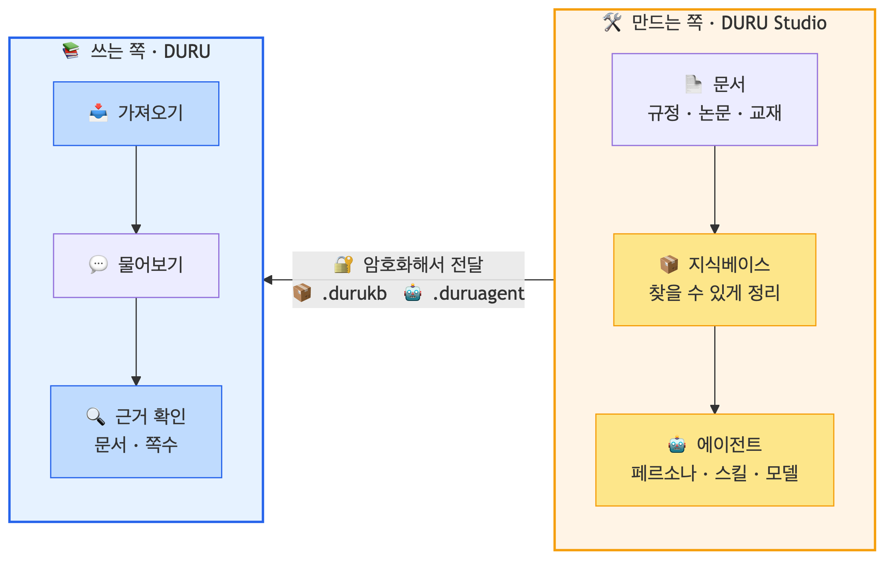
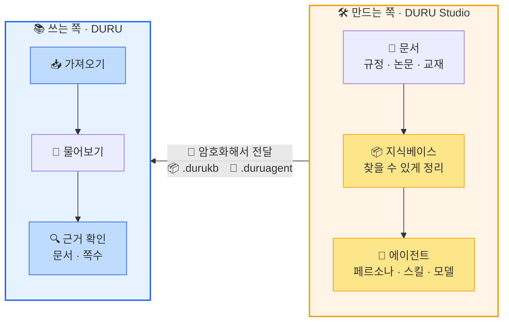

# 📚 DURU — 두루 돕는 AI

**한국어** | [English](README.en.md)

> 연구 · 교육 · 업무를 두루 돕는, 내 PC 안의 AI 에이전트

---

  

---

## 🔎 한눈에

DURU는 **내가 가진 문서를 근거로 답하는 AI**입니다.
클라우드 서비스가 아니라 내 PC에 설치해서 씁니다.

- 📄 **내 문서에서 답을 찾습니다** — 규정집·논문·교재를 넣어 두면, 질문할 때 그 안에서 근거를 찾아 **어느 문서 몇 쪽인지** 함께 알려 줍니다.
- 🔒 **자료가 밖으로 나가지 않습니다** — 문서도 AI 모델도 내 PC 안에 있습니다. **망분리된 내부망**에서도 씁니다.
- 📦 **한 번 만들어 함께 씁니다** — 담당자가 정리해 둔 지식베이스와 에이전트를 **파일로 받으면** 바로 쓸 수 있습니다.
- 💻 **설치가 전부입니다** — 서버도, 전용 그래픽카드도, 운영 담당자도 필요 없습니다.

---

## 🔗 DURU와 DURU Studio

DURU는 **쓰는 쪽**입니다. 무거운 준비는 **만드는 쪽**에서 한 번만 하고,
결과물을 파일로 건네받아 씁니다.

  

도식 원본 (mermaid) — 수정할 때 이 소스를 고쳐 이미지를 다시 만드세요

재생성: `npx -y @mermaid-js/mermaid-cli@11 -i diagram.mmd -o assets/duru_flow.png -b white -s 3`

| | 하는 일 |
| --- | --- |
| 📚 **DURU** 사람마다 한 대 | 받은 파일을 가져와 **질문하고 근거를 확인**합니다 |
| 🛠️ **DURU Studio** 조직에 한 대 | 문서를 지식베이스로 정리하고, 에이전트를 만들어 **파일로 내보냅니다** |

> [!NOTE]
> 직접 만들지 않아도 됩니다. **이미 만들어진 지식베이스와 에이전트를 파일로 받으면**
> 준비 과정 없이 그 자리에서 바로 쓸 수 있습니다.

---

## 👥 어디에 쓰나

| 분야 | 이런 상황 | DURU의 역할 |
| --- | --- | --- |
| 🏛️ 행정 | 규정·지침이 방대해 어디를 봐야 할지 막막할 때 | "이건 규정상 가능한가요?"에 **해당 조문**을 찾아 설명합니다 |
| 🔬 연구 | 논문·보고서 더미에서 필요한 대목을 찾아야 할 때 | 질문 한 번에 **근거 페이지까지** 짚어 줍니다 |
| 🎓 교육 | 수업 자료로 문제를 내거나, 학생이 혼자 공부할 때 | 교재로 퀴즈를 만들고, 쉽게 다시 설명합니다 |
| 💼 사무 | 문서 요약·초안 작성이 반복될 때 | 열려 있는 문서를 보며 요약과 초안을 돕습니다 |

---

## ✨ 주요 기능

### 🔍 근거를 짚어 주는 답변

일반 챗봇은 사실이 아닌 내용을 그럴듯하게 지어낼 수 있습니다.
규정을 다루는 자리에서 그건 도움이 아니라 사고입니다.

DURU는 **등록된 문서 안에서만** 근거를 찾아 답하고, 출처를 함께 보여줍니다.
답변 아래의 근거를 누르면 **원문의 그 자리로** 이동합니다. 맞는지 30초면 확인됩니다.
근거를 찾지 못하면 지어내지 않고 "확인되지 않는다"고 답하도록 되어 있습니다.

문서에서 문단·표·그림이 **어디에 있는지까지** 읽어 두기 때문에,
답변의 근거가 문서의 어느 위치인지 정확히 가리킬 수 있습니다.

표현이 달라도 찾아냅니다. "연구윤리 위반"이라고만 물어도 그 낱말이 없는 조문까지 걸립니다.
반대로 "제7조의2"처럼 **표기가 정확히 맞아야 하는 것**도 놓치지 않습니다.

### 📚 지식베이스

규정집·논문·교재를 넣으면 찾을 수 있는 형태로 정리해 둡니다.
**PC의 폴더를 지정**하면 하위까지 자동 등록되고, PDF·HWP·워드·엑셀·PPT·전자책·스캔본을 다룹니다.

여러 개를 따로 둘 수 있습니다. 규정집과 논문, 교재를 나눠 두고 필요한 것만 골라 물어보면 됩니다.

**분야별 스타터 지식베이스**를 준비하고 있습니다 — 법률·과학기술·경제·행정·교육.

공개 예정 — 저작권 검토를 마친 항목 (지식베이스 파일은 아직 배포 전)

법률 분야 국가법령정보센터 법령 전문 14건. 대한민국 법령은 저작권법 제7조 제1호에 따른
비보호저작물이라 조건 없이 재배포할 수 있습니다.

대한민국헌법 · 민법 · 형법 · 상법 · 형사소송법 · 근로기준법 · 개인정보 보호법 · 저작권법 외 6건

과학기술 · 경제 · 행정공공 · 교육 분야는 재배포 조건이 확정되는 대로 추가됩니다.

### 🤖 분야가 다른 다섯 에이전트

에이전트마다 **대화와 기억이 분리**되어 있습니다.
행정 업무는 하루와, 학습은 토토와 각각 이어서 진행할 수 있습니다.

| 에이전트 | 역할 | 잘하는 일 |
| --- | --- | --- |
| ✨ **별이** | 기본 비서 | 요약, 번역, 분석, 문서 전반의 질의응답 |
| 🐨 **하루** | 행정 도우미 | 공문 초안 작성, 규정·지침에서 근거 찾기 |
| 🦊 **미로** | 일 파트너 | 핵심 정리, 할 일 정리, 문서 검토 |
| 🐥 **토토** | 공부 친구 | 퀴즈 풀기, 쉬운 설명, 실력 진단 |
| 🦉 **초코** | 수업 도우미 | 문제 출제, 수업 자료 만들기 |

### 📦 파일 하나로 주고받기

지식베이스는 `.durukb`, 에이전트는 `.duruagent` 파일로 저장해 건넵니다.
받는 쪽은 **가져오기만 하면** 그대로 씁니다.

준비 작업이 무겁기 때문에 이 점이 중요합니다.
규정집 수백 권을 정리하려면 좋은 PC에서도 시간이 걸리는데,
구성원 100명이 각자 반복할 이유는 없습니다.
**담당자가 한 번 만들어 나눠 주면** 나머지는 기다림 없이 바로 검색합니다.
실제로 규정 문서 159권 분량을 옮겨 봤을 때, **다시 만드는 과정 없이 곧바로** 검색됐습니다.

나눠 줄 때는 보호 장치를 겁니다.

- **암호화** — 암호를 건 파일은 암호를 아는 사람만 엽니다. 메일이나 USB로 오가도 내용이 보이지 않습니다.
- **권한** — 읽기 전용으로 주면 받은 쪽은 보고 검색만 할 수 있고, 문서를 더 넣거나 바꿀 수는 없습니다.
- **무결성 확인** — 전송 중 파일이 손상됐는지 열기 전에 알아냅니다.

### 🔒 내 PC에서 실행

DURU는 클라우드 서비스가 아니라 **내 PC에 설치하는 프로그램**입니다.
문서도, 지식베이스도, 대화 기록도 전부 PC 안에 있습니다.
**밖에 올릴 수 없는 자료**를 다루는 자리가 DURU의 자리입니다.

AI 모델도 밖에 두지 않습니다. **Ollama**로 PC에 설치할 수 있는 소형 모델을 쓰며,
국내 독자 파운데이션 모델 **Solar**(업스테이지)·**EXAONE**(LG AI연구원) 연동을 확인했습니다.
전용 그래픽카드가 없어도 동작하고, **인터넷이 끊긴 내부망에서도** 씁니다.

> [!TIP]
> **서버에 두고 조직이 함께 쓰는 구성이 필요하다면 [DOREA-X](https://github.com/leeryong/DOREA-X)** 를 보십시오.
> 같은 계열의 서버형 제품입니다. 자료를 서버에 올릴 수 있고 운영을 맡을 조직이 있다면 그쪽이 맞고,
> 그렇지 않다면 DURU가 맞습니다 — [어디에 무엇이 맞는지](docs/DURU.md#-6-로컬-실행--자료-보호)

---

## 📖 더 자세히

지식베이스가 무엇인지, 다섯 에이전트가 어떻게 구성되는지,
근거를 어떻게 제시하는지, 패키지로 어떻게 주고받는지

→ **[DURU 소개](docs/DURU.md)**

---

## 📥 배포

윈도우용 설치 파일을 준비하고 있습니다. 공개되면 이 페이지에서 안내합니다.

---

## 🌌 관련 프로젝트

DURU는 KISTI **BLUESKY** 프로젝트의 문서 AI 기술 위에서 만들어졌습니다.

| 시스템 | 소개 |
| --- | --- |
| 🌌 [KISTI-NTIS BLUESKY](https://github.com/leeryong/KISTI_BLUESKY) | 사람과 AI의 협업을 향한 프로젝트 허브 |
| 📄 [DOREA-X](https://github.com/leeryong/DOREA-X) | **서버형** — 조직이 함께 쓰는 문서 AI. 문서 이해·분석·보고서 작성 |
| 🛠️ [NELLA](https://github.com/leeryong/NELLA) | 문서로 도메인 특화 LLM을 만드는 Agentic LLMOps |
| 🎩 [Scarlet](https://github.com/leeryong/Scarlet) | 멀티에이전트 지식 탐색·추론 (홈즈–왓슨) |
| 🌐 [TAW (The Agents Web)](https://github.com/leeryong/The_Agents_Web_TAW/blob/main/README.ko.md) | 에이전트와 사람이 함께 일하는 에이전트 웹 |
| 🗂️ [ParserTry](https://github.com/leeryong/ParserTry) | 30종 PDF 파서 즉시 실행·비교 로컬 웹앱 |

---

  
    <b>DURU</b> · 두루 돕는 AI — KISTI BLUESKY 
    문의: 이용 (ryonglee@kisti.re.kr)
  

